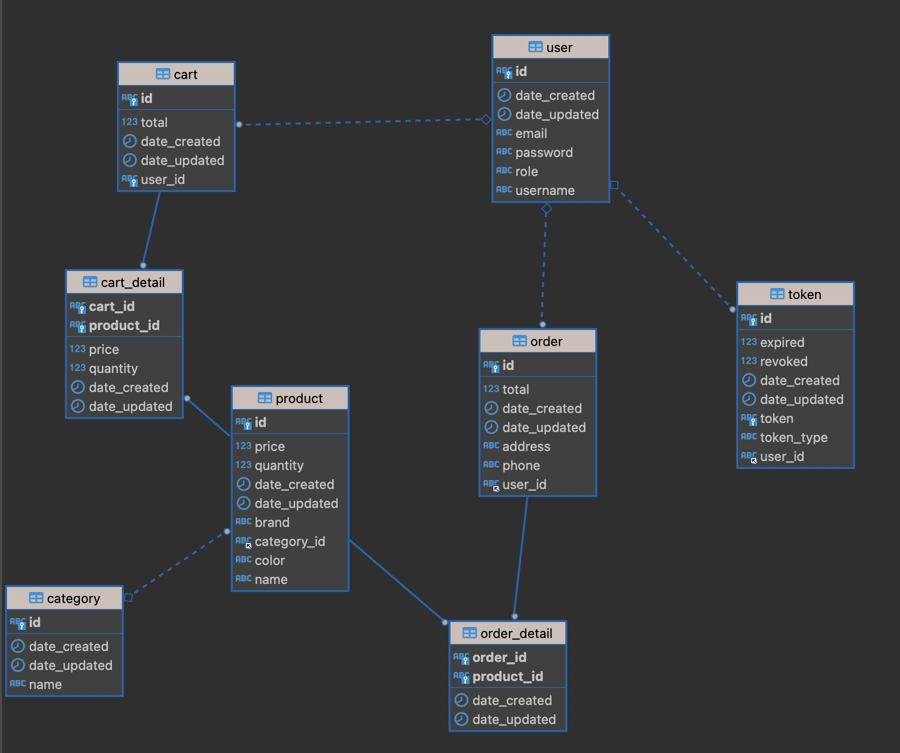

# Spring Commerce
## Problem statement
A small start-up named "SpringCommerce" wants to build a very simple online shopping application to sell their products. In order to get to the market quickly, they just want to build an MVP (Minimum Viable Product) version with a very limited set of functionalities

## Entity-relationship diagram
  
1. Các nguyên tắc, mẫu phát triển phần mềm và thực tiễn đang được áp dụng.
+ Dependency Injection (DI) sử dụng DI thông qua các Annotation như @Autowired, @Component, @Repository, @Service, @Controller để tạo ra các đối tượng và quản lý sự phụ thuộc giữa các đối tượng này.
+ Model-View-Controller (MVC) là một mô hình thiết kế phần mềm cho phép chia nhỏ ứng dụng thành các thành phần riêng biệt và độc lập nhau để dễ dàng quản lý. Trong Project, ta có thể sử dụng các Annotation @Controller, @RequestMapping, @RestController, @Service để triển khai mô hình MVC.
2. Cấu trúc code của dự án:
- Các thư mục quan trọng bao gồm:
    + src/main/java: chứa mã nguồn Java của ứng dụng.
    + src/main/resources: chứa các tài nguyên như file cấu hình, file static, thư mục hình ảnh, file cs và js, v.v.
    + pom.xml: chứa các thông tin về phụ thuộc và cấu hình cho dự án.
    + application.properties: chứa các cấu hình của ứng dụng, ví dụ như cấu hình kết nối cơ sở dữ liệu, cấu hình HTTP, v.v.
- Trong thư mục src/main/java, các package được tổ chức theo mô hình MVC (Model-View-Controller) hoặc theo một số mô hình khác như DAO (Data Access Object), Service, Repository, v.v gồm:
    + Entity: chứa các đối tượng đại diện cho dữ liệu trong ứng dụng.
    + View: chứa các tệp thực hiện chức năng hiển thị giao diện người dùng.
    + Controller: chứa các lớp điều khiển để xử lý các yêu cầu từ người dùng và điều hướng đến các lớp thực hiện chức năng tương ứng.
    + Service: chứa các lớp thực hiện các chức năng xử lý logic nghiệp vụ của ứng dụng.
    + Repository: chứa các lớp thực hiện các thao tác liên quan đến cơ sở dữ liệu của ứng dụng.
3. Tất cả các bước cần thiết để chạy ứng dụng trên máy cục bộ máy tính.
   + Tạo một cơ sở dữ liệu trong MySQL để lưu trữ dữ liệu của ứng dụng.Có thể sử dụng MySQL Workbench hoặc dòng lệnh để tạo cơ sở dữ liệu.
   + Chạy(Run) Spring Boot.